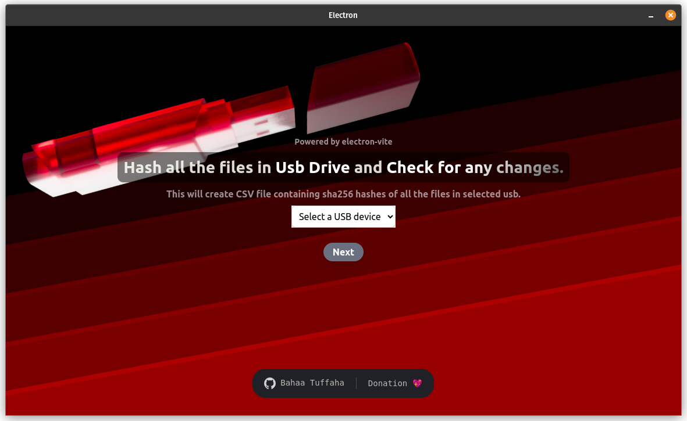

# usbhasher

An Electron application made with React and TypeScript to hash all your files
<ul>
  <li>Hashing files with sha 256.</li>
  <li>It creates a file containg all paths for every file in the selected usb with its hash.</li>
    <li>Detects Addtion,Deletion and modifications.</li>
   <li>It supports windows </img> and linux </img></li>
</ul>

</img>

## Recommended IDE Setup

- [VSCode](https://code.visualstudio.com/) + [ESLint](https://marketplace.visualstudio.com/items?itemName=dbaeumer.vscode-eslint) + [Prettier](https://marketplace.visualstudio.com/items?itemName=esbenp.prettier-vscode)

## Project Setup

### Install

```bash
$ npm install
```

### Development

```bash
$ npm run dev
```

### Build

```bash
# For windows
$ npm run build:win

# For macOS
$ npm run build:mac

# For Linux
$ npm run build:linux
```
